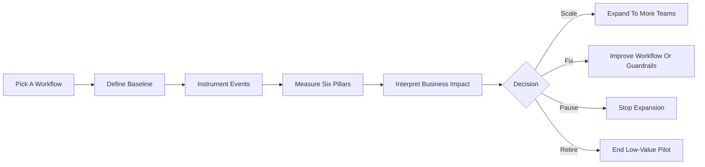

# AI Value Measurement Framework

An open framework for measuring whether AI is creating real business value.

Most companies are measuring AI wrong. They track activity instead of outcomes:

- prompts sent
- chat volume
- story points
- lines of code
- hours saved without evidence

This framework helps teams measure AI in a way leaders can trust. It is designed to work across engineering, support, analytics, operations, and internal copilots.

## What this repo gives you

- a reusable KPI taxonomy for AI value measurement
- scorecards and metric-definition templates
- rollout playbooks for pilots and scaled adoption
- instrumentation guidance and event schemas
- governance and executive review templates
- decision rules for when to scale, fix, pause, or retire workflows

## Who this is for

- CEOs, CIOs, CTOs, and business leaders
- AI platform and transformation teams
- engineering, support, analytics, and operations leaders
- managers running AI pilots in their teams
- internal tool builders and copilots teams

## Start in 60 seconds

- If you are a leader: start with [executive/one-page-ai-roi-summary.md](./executive/one-page-ai-roi-summary.md)
- If you are rolling out a pilot: start with [playbooks/30-day-pilot.md](./playbooks/30-day-pilot.md)
- If you are a manager: start with [playbooks/manager-playbook.md](./playbooks/manager-playbook.md)
- If you are implementing measurement: start with [instrumentation/measurement-guide.md](./instrumentation/measurement-guide.md)
- If you want the guided path: start with [start-here/README.md](./start-here/README.md)

## Core idea

AI does not create value because people used it.

AI creates value when it improves:

- adoption in the right workflows
- speed on meaningful work
- quality of outcomes
- throughput of completed work
- leverage per person or team
- risk and governance control

The framework is reusable across companies because the KPI categories stay mostly the same. What changes by company is:

- which workflows matter most
- which systems contain the source data
- what outcomes the business cares about

## Framework flow



The six pillars are:

- adoption
- speed
- quality
- throughput
- leverage
- risk and governance

## Framework pillars

### 1. Adoption

Measure whether AI is being used in the workflows where it should matter.

Example metrics:

- weekly active AI users in target roles
- percent of eligible workflows using AI assistance
- repeat usage rate after first use
- team-level adoption by function

### 2. Speed

Measure time reduction in meaningful process steps, not vague effort claims.

Example metrics:

- cycle time reduction
- median time to first draft
- mean time to resolution
- analysis turnaround time

### 3. Quality

Measure whether outcomes improved, not just whether work happened faster.

Example metrics:

- rework rate
- defect escape rate
- first-contact resolution
- answer acceptance rate
- audit pass rate

### 4. Throughput

Measure whether the team can complete more useful work with the same capacity.

Example metrics:

- tickets resolved per week
- analyst deliverables completed
- experiments shipped
- documents updated

### 5. Leverage

Measure whether teams can take on more scope or complexity without proportional headcount growth.

Example metrics:

- output per team member
- additional workload absorbed
- ratio of assisted to unassisted completions
- manager span supported by AI-enabled workflows

### 6. Risk and Governance

Measure whether AI usage remains safe, reviewable, and aligned with policy.

Example metrics:

- percent of AI outputs reviewed
- override rate
- policy exception count
- hallucination or factual error rate
- sensitive-data incident count

## What good measurement looks like

Strong AI measurement usually has five characteristics:

1. It starts with a workflow, not a model.
2. It compares against a baseline.
3. It combines leading and lagging indicators.
4. It captures both performance and risk.
5. It includes a business interpretation, not just a number.

## What not to track

Avoid KPIs that reward visible activity instead of useful outcomes.

Common anti-patterns:

- raw chat volume
- prompts per employee
- Jira hours
- story points completed
- lines of code
- unverified time-saved claims
- number of models deployed

See [anti-patterns/README.md](./anti-patterns/README.md) for details.

## Repository structure

```text
ai-value-measurement-framework/
  README.md
  start-here/
  maturity-model/
  executive/
  playbooks/
  integrations/
  governance/
  calculators/
  benchmarks/
  decision-rules/
  templates/
  examples/
  instrumentation/
  anti-patterns/
```

## How to use this framework

1. Pick one high-value workflow.
2. Define the baseline before AI intervention.
3. Choose one or two metrics from each relevant pillar.
4. Instrument the source systems that produce evidence.
5. Review weekly for operational learning and monthly for business impact.
6. Retire metrics that create bad incentives.

If you want a faster starting point, begin with [start-here/README.md](./start-here/README.md).

## Starter use cases

### Engineering

- PR cycle time
- escaped defects
- review turnaround
- deployment frequency
- override rate for AI-generated code suggestions

### Support

- average handle time
- first-contact resolution
- escalation rate
- CSAT movement
- policy exception rate

### Analytics

- time to insight
- dashboard turnaround time
- stakeholder revision count
- decision adoption rate
- data-quality review failures

### Operations

- case processing time
- backlog burn rate
- exception handling volume
- accuracy after human review
- control breach count

## Design principles

- Track business outcomes over user activity.
- Prefer observed behavior over self-reported impact.
- Use simple scorecards before building complex dashboards.
- Treat human override and review as product signals, not nuisances.
- Separate adoption from value. High usage does not guarantee impact.

## Contributing

Contributions are welcome in four forms:

- new metric definitions
- example scorecards for additional functions
- instrumentation patterns for common tool stacks
- case studies showing how teams interpreted results

## Suggested positioning

Use this framing when sharing the project:

> AI does not fail because models are weak. It fails because organizations do not know how to measure value.

## What makes this reusable

This repository is designed to be reusable because it includes:

- common KPI pillars that apply across functions
- templates that teams can adapt without redesigning the framework
- example scorecards for common workflows
- a shared instrumentation model
- governance and executive reporting layers
- role-based and maturity-based adoption paths

## Launch tagline

Measure AI like a business system, not a novelty.
